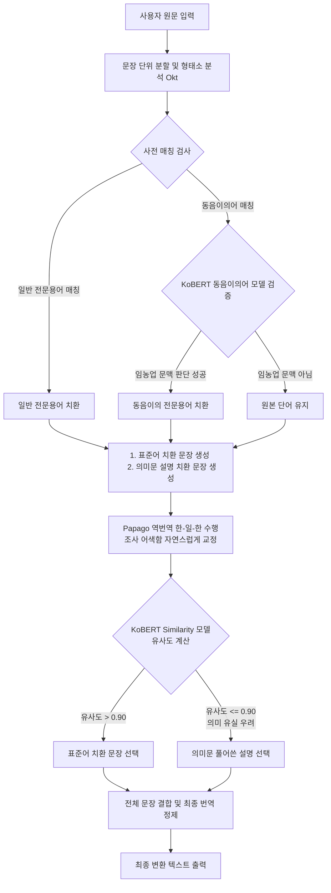

# 🌾 임·농업 전문용어 변환 시스템 - GreenGlossary

본 프로젝트는 한자어나 일제강점기 잔재 등으로 인해 일반 사용자가 이해하기 어려운 임·농업 전문용어(예: 도복, 시비, 정지 등)를 일상에서 읽기 쉬운 표준 순화어와 상세 설명문(의미문)으로 자동 변환해 주는 **자연어 처리(NLP) 기반 웹 애플리케이션**입니다.

이 프로젝트는 형태소 분석기(Okt)를 통한 사전 매칭 기술과 더불어, 딥러닝 기반 문맥 판단 및 문장 유사도 계산 모델(KoBERT), 그리고 외부 번역 엔진(Naver Papago API)의 역번역 기술을 정교하게 결합하여 **의미 유실을 방지하고 조사 불일치 오류를 최소화하는 자연스러운 텍스트 변환 파이프라인**을 구축했습니다.

---

## 📌 목차 바로가기 (Quick Navigation)

*   [🎈 1. 서비스 소개: 그린글로서리(GreenGlossary)](#section-1)
*   [🏗️ 2. NLP 데이터 처리 아키텍처 (NLP Processing Architecture)](#section-2)
*   [📂 3. 프로젝트 디렉토리 구조 (Directory Structure)](#section-3)
*   [🛠️ 4. 사전 데이터 명세 및 동음이의어 모델 정보](#section-4)
*   [🚦 5. 신규 환경 구성 및 실행 절차 (Setup & Run Guide)](#section-5)
*   [🌐 6. REST API 및 라우트 명세 (API & Route Specifications)](#section-6)
*   [🌐 7. 서비스 포트 및 웹 콘솔 정보](#section-7)

---

## <a id="section-1"></a>🎈 1. 서비스 소개: GreenGlossary

**GreenGlossary**는 일반 대중이나 초보 임·농업 종사자들이 한자 중심의 난해한 임·농업 전문 지식 또는 관련 행정/재배 문서에 쉽게 접근할 수 있도록 도와주는 지능형 텍스트 변환 서비스입니다.

### 💡 주요 핵심 기능
* **🌾 전문용어 자동 검출 및 매칭**: 입력 텍스트를 문장 단위로 분할한 뒤, 형태소 분석기(Okt)와 매칭 사전을 통해 문장 내 전문용어를 신속하게 탐색하고 위치를 추출합니다.
* **🤖 동음이의어 문맥 판단 (KoBERT)**: '도복(벼 쓰러짐 vs 운동복)', '화형(꽃의 형태 vs 형벌)', '도장(가지가 무성히 자람 vs 결재 도장)' 등 다중 의미를 가진 한자어를 구분하여 임·농업 용어로 사용된 문맥에서만 지능적으로 변환합니다.
* **⚖️ 의미 유실 방지 (KoBERT Similarity)**: 단순히 단어를 치환했을 때 발생할 수 있는 의미 축소나 왜곡을 방지합니다. 표준 용어로 단순 대체한 문장과 길게 설명형으로 풀어쓴 문장의 유사도를 KoBERT Embedding 기반으로 비교하여 최적의 표현을 자동 선택합니다.
* **✏️ 자연스러운 조사 교정 (Papago 역번역)**: 명사가 교체되면서 발생하는 어색한 한글 조사 불일치 현상(예: `도복(벼 쓰러짐)이` ➔ `쓰러짐이` 등)을 Naver Papago API 한-일-한 역번역 기능을 통해 매끄럽게 문맥을 교정합니다.
* **⚡ Lazy Initialization 패턴**: 무거운 딥러닝(KoBERT) 모델 로딩으로 인한 초기 애플리케이션 구동 병목을 해결하기 위해 첫 API 호출 시 모델을 지연 로딩하는 최적화 패턴을 구현하여 서버 가용성을 높였습니다.

---

## <a id="section-2"></a>🏗️ 2. NLP 데이터 처리 아키텍처 (NLP Processing Architecture)

전체 시스템의 NLP 변환 및 교정 흐름은 데이터 흐름과 딥러닝 모델 추론의 역할에 따라 아래와 같은 파이프라인으로 설계되었습니다.



### 1) 형태소 분석 및 매칭 단계 (Morphology & Matching)
* **구성**: `konlpy.tag.Okt`, `dictionary.py`
* **역할**: 입력 텍스트를 문장 단위로 쪼갠 후 명사, 조사 등을 태깅합니다. 구축된 농업 전문용어 엑셀 사전을 로딩하여 문맥 속 전문용어의 위치(`[sentence_idx, token_idx]`)를 찾아냅니다.

### 2) 문맥 판별 단계 (Contextual Homonym Resolution)
* **구성**: `KoBERT_homonym_dobok`, `KoBERT_homonym_hwa`, `KoBERT_homonym_dojang`
* **역할**: 동음이의어인 '도복', '화형', '도장'이 문장 속에서 임·농업 용어로 쓰였는지, 아니면 일상적인 용어(예: 무술 도복, 화형식, 인감도장)로 쓰였는지 예측 확률 80% 기준으로 검증합니다.

### 3) 후보 문장 생성 단계 (Dual Sentence Generation)
* **구성**: `nlp_processor.py`
* **역할**: 전문용어로 최종 판별된 토큰을 대상으로 **① 표준어(std_name) 치환 문장**과 **② 상세 설명문(mean_s) 치환 문장**을 이중 구조로 독립 생성합니다.

### 4) 조사 교정 및 유사도 분석 단계 (Grammar Polish & Similarity Selection)
* **구성**: `translator.py` (Naver Papago API), `KoBERT_similarity`
* **역할**: 
  * 치환으로 인해 조사가 어색해진 두 문장을 네이버 파파고 API를 활용해 한-일-한 역번역하여 자연스러운 한글 문장으로 교정합니다.
  * 역번역된 표준어 문장과 설명문 문장을 KoBERT Similarity 임베딩 모델에 넣어 코사인 유사도를 구합니다. 유사도가 `0.90` 이하로 떨어질 경우 의미 유실 가능성이 높다고 판단하여, 설명문 문장을 최종 텍스트로 채택합니다.

---

## <a id="section-3"></a>📂 3. 프로젝트 디렉토리 구조 (Directory Structure)

프로젝트 루트를 기준으로 한 전체적인 소스코드와 사전 데이터, 딥러닝 가중치 보관 구조입니다.

```text
GreenGlossary/ (프로젝트 루트)
├── app.py                  # Flask 웹 애플리케이션 진입점 (Lazy Initialization 적용)
├── server.py               # 하위 호환성 유지를 위한 래퍼 구동 스크립트
├── config.py               # Papago API Credentials 및 데이터/모델 경로 설정 파일
├── requirements.txt        # 프로젝트 의존성 라이브러리 목록 (TensorFlow, Pandas, Konlpy 등)
├── .env.template           # API Credentials 설정을 위한 환경 변수 템플릿
├── README.md               # 프로젝트 매뉴얼 (본 문서)
│
├── src/                    # NLP 핵심 비즈니스 로직 모듈 폴더
│   ├── __init__.py         
│   ├── dictionary.py       # 농업 단어 사전 엑셀 로딩 및 전처리 모듈
│   ├── models.py           # KoBERT 기반 Similarity 및 Homonym 모델 로더 및 추론 클래스
│   ├── nlp_processor.py    # 형태소 분석, 사전 매칭, 용어 치환 및 번역/유사도 결합 제어
│   └── translator.py       # Naver Papago API 기반 한-일-한 역번역 래퍼
│
├── model/                  # 학습된 KoBERT 모델 가중치 세이브 폴더
│   ├── KoBERT_similarity/     # 문장 유사도 계산을 위한 Sentence-BERT 모델
│   ├── KoBERT_homonym_dobok/  # '도복' 동음이의어 판별 모델
│   ├── KoBERT_homonym_hwa/    # '화형' 동음이의어 판별 모델
│   └── KoBERT_homonym_dojang/ # '도장' 동음이의어 판별 모델
│
├── data/                   # 매칭용 사전 데이터 폴더
│   └── agriculture_dictionary.xlsx # 전문용어-표준어-의미문 매핑 엑셀 데이터
│
├── static/                 # 웹 페이지 정적 리소스 폴더
│   └── css/                # 스타일시트 파일들
└── templates/              # Flask 렌더링용 HTML 템플릿 폴더
    ├── home.html           # 원문 입력 및 처리 요청 페이지
    └── after.html          # 변환 결과 시각화 페이지
```

---

## <a id="section-4"></a>🛠️ 4. 사전 데이터 명세 및 동음이의어 모델 정보

### 1) 사전 데이터 명세 (`agriculture_dictionary.xlsx`)
매칭용 사전 엑셀 파일은 다음과 같은 정규화 형식으로 구조화되어 있습니다.

| 컬럼명 | 타입 | 설명 | 예시 |
| :---: | :--- | :--- | :--- |
| **`jargon_name`** | String (PK) | 변환 및 탐색 대상이 되는 임·농업 전문용어 | 도복, 시비, 정지 |
| **`std_name`** | String | 1:1로 자연스럽게 치환되는 정제된 표준 순화어 | 쓰러짐, 거름주기, 가지 다듬기 |
| **`mean_s`** | String | 단순 치환 시 의미 유실이 생길 때 사용될 상세 설명문 | (식물이) 쓰러짐, 비료를 줌, 가지를 자르고 정리함 |

### 2) 동음이의어 판별 모델 매핑 정보
문장 속 단어의 문맥을 분류하기 위해 학습된 개별 딥러닝 분류기 가중치 경로 정보입니다.

| 대상 용어 | 문맥 분류 기준 | 관련 모델 경로 |
| :---: | :---: | :--- |
| **도복** | 임·농업(식물이 쓰러짐) vs 일반(도복을 입다) | `model/KoBERT_homonym_dobok` |
| **화형** | 임·농업(꽃의 형태) vs 일반(화형을 집행하다) | `model/KoBERT_homonym_hwa` |
| **도장** | 임·농업(가지가 헛자람) vs 일반(도장을 찍다) | `model/KoBERT_homonym_dojang` |

---

## <a id="section-5"></a>🚦 5. 신규 환경 구성 및 실행 절차 (Setup & Run Guide)

### [Step 1] 사전 요구사항 확인
1. 사용하시는 로컬 PC에 **Python 3.8 이상** 환경이 구성되어 있는지 확인합니다.
2. `KoNLPy` 라이브러리의 형태소 분석기 `Okt`를 구동하기 위해 **JDK(Java Development Kit)** 설치 및 `JAVA_HOME` 환경 변수 설정이 정상적으로 잡혀 있는지 확인합니다.

### [Step 2] 의존성 라이브러리 설치
터미널을 열고 프로젝트 루트 디렉토리(`GreenGlossary/`)에서 아래 명령어를 실행하여 머신러닝 및 웹 프레임워크 구동에 필요한 라이브러리를 설치합니다.
```bash
pip install -r requirements.txt
```

### [Step 3] 딥러닝 모델 가중치 파일 다운로드
본 프로젝트의 딥러닝(KoBERT) 모델 가중치는 대용량 파일이기 때문에 Git 저장소에 업로드되어 있지 않습니다.
애플리케이션을 구동하기 전, 반드시 다음 파이썬 스크립트를 실행하여 모델 파일을 자동으로 다운로드받아 주셔야 합니다.

```bash
# 구글 드라이브로부터 모델 파일 자동 다운로드 및 압축 해제
python download_models.py
```
* **참고**: `gdown` 라이브러리(Step 2에서 설치됨)를 활용해 구글 드라이브에 공유된 압축 파일을 내려받아 `model/` 디렉터리에 자동으로 배치를 완료합니다.

### [Step 4] API Key 설정 (.env 파일 작성)
본 시스템은 어색한 한글 조사를 매끄럽게 교정하기 위해 Naver Papago API 역번역 기능을 이용합니다.
1. 루트 디렉토리에 있는 `.env.template` 파일을 복사하여 `.env` 파일을 생성합니다.
```bash
cp .env.template .env
```
2. 생성된 `.env` 파일을 텍스트 에디터로 열어 네이버 개발자 센터에서 발급받은 API 키를 입력합니다.
```env
PAPAGO_CLIENT_ID=여러분의_Papago_Client_ID
PAPAGO_CLIENT_SECRET=여러분의_Papago_Client_Secret
```

### [Step 5] 애플리케이션 실행
모든 인프라 설정이 완료되면 웹 서비스를 가동합니다.
```bash
python app.py
# 또는 구버전 스크립트와의 호환 작동이 필요할 시 아래 명령어 실행
python server.py
```
* **동작 내용**: 구동 즉시 모델 로더가 실행되어 `model/` 폴더 내에 저장된 4개의 TensorFlow SavedModel을 로컬 메모리로 지연 로딩(Lazy loading)한 후 5000번 포트로 웹 서비스를 개시합니다.
* **대기 시간**: 딥러닝 모델의 무게로 인해 최초 구동 완료 단계까지 시스템 사양에 따라 약 30초~1분 정도 소요될 수 있습니다.

### [Step 6] 서비스 접속 및 테스트
서버 구동 완료 메시지를 확인한 후 웹 브라우저를 통해 아래 로컬 호스트 주소에 접속하여 입력창에 임농업 관련 텍스트(예: *"태풍으로 인해 벼의 도복이 발생하여 농가가 시비를 서두르고 있다."*)를 입력하고 처리 결과를 확인합니다.
* **웹 서비스 주소**: [http://127.0.0.1:5000](http://127.0.0.1:5000)

> [!IMPORTANT]
> **[참고 사항: Papago API Credentials 미입력 시 작동 안내]**

> 만약 사용자가 `.env` 파일에 네이버 파파고 API Client ID 및 Secret Key를 별도로 입력하지 않은 상태로 구동할 경우, `config.py`에 선언된 **기본 테스트용 공용 Credentials**를 기본값으로 삼아 자동 동작합니다.
> 단, 공용 키의 일일 호출 쿼터 제한이 초과될 경우 역번역 서비스가 정상 동작하지 않고 원문 그대로 출력될 수 있으므로 안정적인 이용을 위해 개인 API Key 세팅을 권장합니다.

---

## <a id="section-6"></a>🌐 6. REST API 및 라우트 명세 (API & Route Specifications)

Flask로 구동되는 웹 애플리케이션의 라우트 매핑 구조입니다.

| HTTP Method | URI | 설명 |
| :---: | :--- | :--- |
| `GET` | `/` | 메인 페이지 입력 폼 홈 화면 렌더링 (`templates/home.html`) |
| `POST` | `/result` | 전송된 텍스트 원문의 전문용어 검출, 문맥 판별, 조사 교정 NLP 분석을 수행한 후 결과 페이지 렌더링 (`templates/after.html`) |

### `POST /result` 요청 및 응답 명세
* **요청 바디 (Form Data)**:
  * `news_original` (String): 변환할 임·농업 관련 원천 텍스트 문장
* **응답 템플릿 컨텍스트 변수 (Render Context)**:
  * `original` (String): 사용자가 처음에 입력한 날것의 원본 텍스트
  * `result` (String): NLP 파이프라인(사전 매칭 -> KoBERT 문맥 판단 -> Papago 역번역 및 KoBERT Similarity 최적 유사도 선정)을 통과한 자연스러운 최종 변환 텍스트

---

## <a id="section-7"></a>🌐 7. 서비스 포트 및 웹 콘솔 정보

| 분류 | 서비스명 | 접속 주소 (URL) | 비고 |
| :---: | :--- | :--- | :--- |
| **애플리케이션** | Flask Web Server | [http://127.0.0.1:5000](http://127.0.0.1:5000) | 임·농업 전문용어 변환 사용자 웹 인터페이스 |
| **외부 API 연동** | Naver Papago API | `https://openapi.naver.com/v1/papago/n2mt` | 한-일-한 역번역 조사 교정 통신 대상 API |
