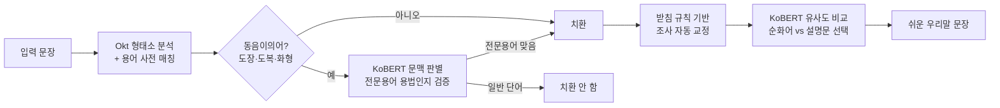

# 🌱 GreenGlossary — 농림 전문용어 순화 번역기

> **🌐 Live Demo:** **[demo-gateway.trealight112.workers.dev/greenglossary](https://demo-gateway.trealight112.workers.dev/greenglossary/)** — 문장을 직접 넣어 체험해보세요!  
> **Project:** 상명대학교 캡스톤 디자인 (산림·농업 번역 시스템)  
> **Revived & Refactored for Live Demo:** 2026.08.20

산림·농업 분야 문서에는 "간벌", "복토", "몽리 면적" 같은 어려운 한자어 전문용어가 많아 일반인의 접근성이 낮습니다. GreenGlossary는 **801개 전문용어 사전과 KoBERT 딥러닝 모델**을 결합해 이런 문장을 **쉬운 우리말로 자동 순화**합니다.

---

## 🔬 순화 파이프라인


```mermaid
flowchart LR
    A[입력 문장] --> B[Okt 형태소 분석<br>+ 용어 사전 매칭]
    B --> C{동음이의어?<br>도장·도복·화형}
    C -->|예| D[KoBERT 문맥 판별<br>전문용어 용법인지 검증]
    C -->|아니오| E[치환]
    D -->|전문용어 맞음| E
    D -->|일반 단어| F[치환 안 함]
    E --> G[받침 규칙 기반<br>조사 자동 교정]
    G --> H[KoBERT 유사도 비교<br>순화어 vs 설명문 선택]
    H --> I[쉬운 우리말 문장]
```

1. **사전 매칭** — Okt 형태소 분석 후 801개 용어 사전과 위치 기반 매칭
2. **동음이의어 판별** — "도장"(찍는 도장? 나무의 도장지?)처럼 일상어와 겹치는 용어는 문장 문맥을 KoBERT 분류 모델이 판별해 전문용어 용법일 때만 치환
3. **치환 + 조사 교정** — 치환 후 받침이 달라지면 조사(을/를, 이/가, 은/는, 과/와, 으로/로)를 규칙 기반으로 자동 교정 (예: "간벌**을**" → "솎아베기**를**")
4. **문장 선택** — 짧은 순화어 버전과 설명문 버전을 KoBERT 문장 유사도로 비교해, 의미 훼손이 우려되면(유사도 ≤ 0.9) 더 설명적인 버전 채택

---

## ♻️ 2026 리뉴얼 (라이브 데모 개편)

| 분류 | 내용 |
|---|---|
| **대체** | 조사 교정에 쓰던 Papago 한-일-한 역번역이 **API 서비스 종료**로 동작 불가 → 형태소 태그 기반 **결정론적 조사 교정 규칙**으로 대체 (외부 API 의존 제거, 항상 동작, 즉시 응답) |
| **개편** | Flask 단일 앱 → **Gradio API 서버(`demo_api.py`) + 커스텀 프론트엔드** 2-티어 구조. Flask 앱(`app.py`+`server.py`)은 로컬 실행용으로 유지 |
| **개선** | 치환 내역(용어/순화어/설명/동음이의어 판별 여부)을 구조화해 반환 — 프론트에서 하이라이트 표시 |
| **정리** | 미사용 파일 제거(구 번역기, 템플릿 README, 무관한 이미지), eager import 정리, 하드코딩됐던 API 키는 이전에 폐기·제거 완료 |

---

## 🌐 라이브 데모 아키텍처

```text
[커스텀 프론트엔드]                        [백엔드 API]                       [모델 저장소]
Cloudflare                          ──▶ HF Space: kimjgwang/ml-demos  ──▶ HF Model: greenglossary-kobert
demo-gateway/greenglossary/             /simplify API (Py 3.11·TF 2.15)    KoBERT SavedModel 4종 (1.3GB)
문장 입력·용어 하이라이트/카드            Cafe-Focusing과 통합 호스팅          기동 시 snapshot_download
```

- HF 무료 티어 제약(ZeroGPU Space 2개, Space 저장소 1GB)에 맞춰 **백엔드는 통합 Space**([kimjgwang/ml-demos](https://huggingface.co/spaces/kimjgwang/ml-demos))에서, **모델은 별도 Model 저장소**([kimjgwang/greenglossary-kobert](https://huggingface.co/kimjgwang/greenglossary-kobert))에서 제공
- KoNLPy(Okt)의 JVM 의존성은 HF `packages.txt`(default-jre)로 해결

---

## 📂 디렉터리 구조

```text
GreenGlossary/
├── demo_api.py             # 라이브 데모용 Gradio API 서버 (HF Spaces 진입점)
├── app.py / server.py      # Flask 웹앱 (로컬 실행용)
├── config.py               # 모델/데이터 경로 설정
├── download_models.py      # KoBERT 모델 다운로드 스크립트 (HF Hub)
├── Dockerfile              # 도커 이미지 (py3.11 + TF 2.15 + JRE, 모델 자동 다운로드)
├── requirements.txt        # 의존성 (TF 2.15 고정 — SavedModel 호환)
├── packages.txt            # HF Spaces 시스템 패키지 (JVM)
├── data/
│   └── agriculture_dictionary.xlsx  # 전문용어 사전 (801개)
├── src/
│   ├── dictionary.py       # 용어 사전 로더
│   ├── models.py           # KoBERT 모델 매니저 (유사도/동음이의어)
│   └── nlp_processor.py    # 매칭·치환·조사 교정·문장 선택 파이프라인
├── templates/ · static/    # Flask 화면
└── model/                  # KoBERT 모델 4종 (git 미추적 — download_models.py로 다운로드)
```

---

## 🛠️ 실행 방법

### 도커로 실행 (권장 — Windows에서도 모델 추론 가능)
`tensorflow-text`가 Windows 휠을 제공하지 않아 로컬 추론이 불가능했던 문제를 Linux 컨테이너로 해결합니다. KoBERT 모델(~1.3GB)은 기동 시 HF 모델 저장소에서 자동 다운로드됩니다.
```bash
docker build -t greenglossary .
docker run -p 5000:5000 greenglossary
```
→ http://localhost:5000 에서 Flask 웹앱이 열립니다.

### 직접 실행 (Linux)
```bash
pip install -r requirements.txt   # Linux 기준 (tensorflow-text는 Windows 미지원)
python download_models.py         # KoBERT 모델 다운로드 (~1.3GB, HF Hub)
python demo_api.py                # Gradio API/UI — http://localhost:7860
# 또는 Flask 웹앱: python server.py — http://localhost:5000
```

> Windows에서 직접 실행 시에는 `tensorflow-text` 휠이 없어 모델 추론이 불가합니다 — 위의 도커 방식을 사용하세요.
> 사전 매칭·조사 교정 로직은 모델 없이도 동작합니다 (`konlpy`, `pandas`, `openpyxl`만 설치).

---

## 🎯 사용한 기술

* **NLP** — KoNLPy(Okt) 형태소 분석, KoBERT 문장 유사도·이진 분류 (TensorFlow 2 / tensorflow-text)
* **Backend** — Gradio (API 서버), Flask (로컬 웹앱)
* **Data** — 농림 전문용어 사전 801개 (엑셀 기반)
