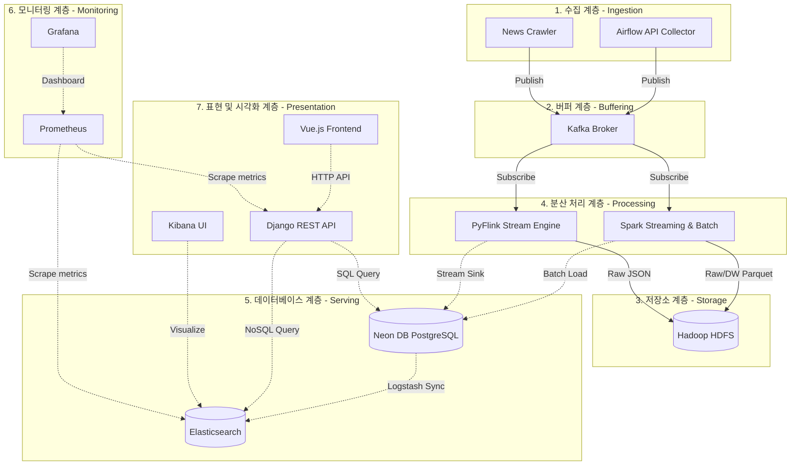

# 💵 개인 투자자를 위한 스마트 채권 포털 - 채권이지(BondEZ)

개인 투자자에게 필요한 **채권 기본 정보, 이자 지급 일정, 신용등급, 실시간 관련 뉴스, 금융 용어 사전**을 자동으로 수집·가공하여 한눈에 볼 수 있도록 통합 서빙하는 **채권이지(BondEZ)** 서비스입니다.

이 프로젝트는 분산 메시지 큐(Kafka), 분산 파일 시스템(HDFS), 데이터 처리 클러스터(Spark/Flink), 그리고 워크플로우 엔진(Airflow)을 아우르는 **대용량 데이터 엔지니어링 파이프라인**을 구축하여 신뢰성 있고 유실 없는 데이터 유통 환경을 구성했습니다.

---

## 📌 목차 바로가기 (Quick Navigation)

*   [🎈 1. 서비스 소개: 채권이지(BondEZ)](#section-1)
*   [🏗️ 2. 계층별 데이터 아키텍처 (Data Architecture Layers)](#section-2)
*   [📂 3. 프로젝트 디렉토리 및 HDFS 구조 (Directory & HDFS Structure)](#section-3)
*   [🛠️ 4. 관계형 DB 테이블 명세 및 ERD](#section-4)
*   [🚦 5. 신규 환경 복구 및 최초 실행 절차 (Setup & Run Guide)](#section-5)
*   [🌐 6. REST API 명세 (API Specifications)](#section-6)
*   [🌐 7. 서비스 포트 및 웹 콘솔 정보](#section-7)

---

## <a id="section-1"></a>🌟 1. 서비스 소개: 채권이지(BondEZ)

**채권이지(BondEZ)**는 기관 투자자에 비해 정보 접근성이 떨어지는 개인 투자자들을 위해, 인터넷 곳곳에 흩어져 있는 채권 데이터를 한데 모아 쉽고 편리하게 제공하는 **스마트 채권 & 뉴스 통합 정보 포털**입니다.

### 💡 주요 핵심 기능
* **💵 통합 채권 정보 조회**: 국채, 금융채, 회사채 등 시중의 다양한 채권 기본 스펙(표면금리, 만기일, 이자 주기 등)부터 이자 지급 현금흐름, 조기상환 옵션 일정까지 상세히 조회할 수 있습니다.
* **📰 실시간 뉴스 및 AI 핵심 요약**: 채권 시장 및 거시경제에 영향을 미치는 주요 금융 뉴스들을 실시간으로 수집하고, LLM(Gemini) 모델을 연동하여 핵심 요약 내용을 바로 제공합니다.
* **📈 거시경제 및 핵심 투자 지표**: 주요 국가의 기준금리, 만기별 국고채 금리, 장단기 금리차(10Y-3Y), 예금 금리 비교 데이터 및 신용등급별 평균 YTM 통계 데이터를 제공합니다.
* **📚 금융 용어 사전**: 한국은행이 선정한 경제금융용어 800선을 기반으로 난이도별(입문, 기초, 중요, 심화) 및 카테고리별 전문 금융 용어를 쉽게 풀어서 해설합니다.
* **💬 AI 투자 Q&A 챗봇**: 채권 지식이나 경제 지표, 포털 서비스 사용법에 관한 질문에 대화형 AI(Gemini API)가 실시간 데이터를 연동하여 직관적인 답변을 제공합니다.
* **📂 가상 포트폴리오 및 즐겨찾기**: 관심 채권을 즐겨찾기 목록에 등록하거나, 가상으로 채권을 매입한 내역을 등록하여 본인만의 포트폴리오를 편리하게 관리하고 자산 추이를 모니터링할 수 있습니다.

---

## <a id="section-2"></a>🏗️ 2. 계층별 데이터 아키텍처 (Data Architecture Layers)

전체 시스템 아키텍처는 데이터 유통의 목적과 흐름에 따라 **7개의 독립된 계층(Layer)**으로 설계되었습니다.



### 1) 수집 계층 (Ingestion Layer)
* **구성**: `Airflow API Collector` (배치 수집), `News Crawler` (실시간 뉴스 스크래퍼)
* **역할**: 외부 오픈 API(금융위원회 공공데이터) 및 금융 웹 뉴스 포털로부터 채권 스펙, 시세, 뉴스 원본 데이터를 수집하여 버퍼 계층으로 실시간 전송합니다.

### 2) 버퍼 계층 (Buffering Layer)
* **구성**: `Apache Kafka` (Zookeeper 연계)
* **역할**: 대량의 유입 데이터 스트림을 순차 수신하는 완충망입니다. 장애 전파를 차단하고 이종 엔진(Spark, Flink)이 각자의 처리 속도에 맞춰 데이터를 구독(Subscribe)할 수 있도록 지원합니다.
  * **핵심 토픽**: `topic_bond_raw` (채권 데이터), `topic_news_raw` (실시간 뉴스)

### 3) 저장소 계층 (Storage Layer)
* **구성**: `Hadoop HDFS` (NameNode & DataNode)
* **역할**: 원천 및 가공 데이터를 수집 날짜별 폴더 구조(`/raw/bonds/bas_dt=YYYYMMDD/`, `/raw/news/`)로 안전하게 보관하는 대용량 분산 파일 스토리지입니다. 
* **데이터 보존 정책 (Retention)**: 매일 실행되는 WebHDFS 클린업 테스크를 통해 30일이 지난 과거 파티션 폴더를 자동으로 영구 삭제하여 시스템 용량을 보존합니다.

### 4) 분산 처리 및 가공 계층 (Processing Layer)
* **구성**: `Apache Spark` (Streaming & Batch), `Apache Flink` (Stream Processor)
* **역할**:
  * **Spark**: Kafka의 스트림 데이터를 HDFS에 구조화 적재(Streaming)하고, 일 단위 벌크 데이터를 메모리상에서 중복 제거 및 가공(Batch)하여 가공 완료 영역(`dw/`)에 적재합니다.
  * **Flink**: 실시간 뉴스 스트림을 처리하여 형식을 정규화하고 관계형 데이터베이스와 HDFS 파일 백업 저장소에 동시 적재(Dual-Sink)합니다.

### 5) Serving 계층 (Serving/Database Layer)
* **구성**: `Neon DB (PostgreSQL)`, `Elasticsearch`, `Logstash`
* **역할**: 
  * **Neon DB**: 사용자 포털에 최종적으로 가공된 정보를 제공하는 데이터웨어하우스 및 트랜잭션 DB입니다. 스테이징 테이블과 트리거/프로시저를 이용해 안전하게 데이터를 통합합니다.
  * **Elasticsearch & Logstash**: Logstash를 이용해 Neon DB의 최종 채권 테이블 변경 데이터를 실시간 동기화하여 고속 검색 인덱스(`bonds_search`)를 구축하고 전문 검색 기능을 지원합니다.

### 6) 모니터링 계층 (Monitoring Layer)
* **구성**: `Prometheus`, `Grafana`
* **역할**: 각 가동 컨테이너 서비스 및 호스트의 상태, 애플리케이션 지표(지연 시간, 리소스 사용량, TPS 등)를 수집하여 시각화함으로써 전체 시스템의 성능 및 동작 상태를 관제합니다.
  * **Prometheus**: 실시간 메트릭 정보를 주기적으로 스크랩하여 저장합니다.
  * **Grafana**: 시각적인 종합 감시 모니터링 대시보드를 사용자 및 개발자에게 실시간으로 제공합니다.

### 7) 표현 및 시각화 계층 (Presentation & Visualization Layer)
* **구성**: `Django API Backend`, `Vue.js Frontend`, `Kibana`
* **역할**: 사용자가 모바일/웹 브라우저를 통해 포털을 이용할 수 있도록 프론트엔드 및 백엔드 REST API를 구현하였으며, Kibana를 통해 엘라스틱서치 검색 데이터를 모니터링 및 시각화합니다.

---

## <a id="section-3"></a>📂 3. 프로젝트 디렉토리 및 HDFS 구조 (Directory & HDFS Structure)

### 1) 프로젝트 디렉토리 트리 구조
```text
de_pjt/ (프로젝트 루트)
├── backend-pjt/                    # Django 백엔드 프로젝트 폴더
│   ├── apps/                       # 도메인별 백엔드 앱 (accounts, bonds, glossary, indicators, news 등)
│   │   └── bonds/                  
│   │       ├── models.py           # 채권 DB 모델 및 스키마 클래스
│   │       ├── selectors.py        # 필터링 및 쿼리 비즈니스 로직 (has_price 등 필터 지원)
│   │       └── serializers.py      # 클라이언트 응답용 데이터 포맷팅 및 정제 (NONE 평정 등)
│   ├── config/                     # Django 설정 파일 폴더
│   └── manage.py                   # Django 커맨드라인 유틸리티
│
├── frontend-pjt/                   # Vue.js 프론트엔드 프로젝트 폴더
│   ├── src/
│   │   ├── api/                    # 백엔드 통신 API 래퍼 및 캐시 모듈 (bonds.js, indicators.js 등)
│   │   ├── components/             # 공통 UI 컴포넌트
│   │   └── pages/                  # 화면 단위 Vue 컴포넌트 (market/MarketPage.vue, home/HomePage.vue 등)
│   └── vite.config.js              # Vite 프론트엔드 빌드 및 프록시 설정
│
├── data-pjt/                       # 데이터 엔지니어링 파이프라인 폴더
│   ├── airflow/                    # Apache Airflow 관련 설정 및 DAG 파일
│   │   └── dags/                   
│   │       ├── bond_full_pipeline_dag.py        # 채권 적재 파이프라인 전체 DAG 정의
│   │       └── tasks/                           # 세부 실행 테스크 스크립트 (Spark/DB/HDFS 툴)
│   ├── flink/                      # Apache Flink 스트리밍 처리 관련 소스코드
│   │   └── news_processor.py       # 실시간 뉴스 듀얼 싱크 적재 스크립트
│   ├── postgres/                   
│   │   └── init.sql                # DB 스키마 생성 및 normalize_bonds_staging() 프로시저
│   ├── producer/                   
│   │   ├── interest_rate_loader.py # ECOS/FRED 금리 API 수집기
│   │   └── news_crawler.py         # 실시간 뉴스 크롤러 프로듀서
│   └── requirements.txt            # 파이프라인 가동 패키지 정의
│
├── monitoring/                     # 관제 시스템(Prometheus, Grafana) 설정 파일 폴더
│
├── .env.example                    # 프로젝트 배포 시 복사하여 사용할 환경 설정 템플릿
├── docker-compose.yml              # 애플리케이션 서비스용 도커 컴포즈 파일 (Web/Search)
├── docker-compose-data.yml         # 데이터 파이프라인용 도커 컴포즈 파일 (Kafka/Hadoop/Spark/Airflow)
├── docker-compose-monitoring.yml    # 관제용 도커 컴포즈 파일 (Grafana/Prometheus)
│
├── service.sh                      # 웹 서비스 구동 및 Django 마이그레이션 자동화 쉘 스크립트
├── data.sh                         # 데이터 파이프라인 인프라 구동 및 HDFS 초기화 쉘 스크립트
└── monitoring.sh                   # 관제 서비스 구동 쉘 스크립트
```

### 2) HDFS 디렉토리 및 파일 구조
HDFS 분산 스토리지 내에 저장되는 원천/가공 데이터와 Spark 메타데이터의 물리적 구조입니다.
```text
HDFS Root (/)
├── raw/                        # 1. 수집 원천 데이터 영역
│   ├── bonds/                  # 채권 API 원본 데이터 (Parquet 포맷)
│   │   ├── _spark_metadata/    # Spark Structured Streaming 파일 상태 메타데이터
│   │   ├── bas_dt=20260621/    # 6월 21일 수집 채권 데이터 파티션 폴더
│   │   │   └── part-...snappy.parquet (~18.9MB)
│   │   └── bas_dt=20260622/    # 6월 22일 수집 채권 데이터 파티션 폴더
│   │       └── part-...snappy.parquet (~28.4MB)
│   │
│   └── news/                   # 실시간 수집 뉴스 원본 데이터 (JSON 포맷)
│       └── bas_dt=20260622/    # Flink가 write_date에서 동적 추출한 오늘 자 뉴스 파티션
│           └── .part-...inprogress... (실시간 유입 중인 데이터 쓰기 세션 파일)
│
├── dw/                         # 2. 데이터 웨어하우스 (가공 및 적재용) 영역
│   └── bonds/                  # 중복 제거 및 가공 완료된 테이블 데이터
│       ├── _SUCCESS            # 배치 처리 최종 성공 플래그 파일
│       └── bas_dt=20260622/    # 6월 22일 배치 처리된 정규화 데이터 파티션
│           └── part-...snappy.parquet
│
└── spark/                      # 3. Spark 시스템 메타데이터 영역
    └── checkpoints/            # Spark 스트리밍 유실 방지용 체크포인트
        └── kafka_to_hdfs/      # Kafka-to-HDFS 파이프라인의 오프셋 및 오프셋 커밋 정보
```

---

## <a id="section-4"></a>🛠️ 4. 관계형 DB 테이블 명세 및 ERD

데이터베이스에 적재 완료된 관계형 테이블 구조 및 설계 다이어그램(ERD) 정보입니다.

### 1) 관계형 데이터베이스 ERD 다이어그램


### 2) 테이블 상세 명세
현재 데이터베이스(`bonds_db`) 내의 모든 관계형 테이블은 **소문자 및 스네이크 케이스(Snake Case)** 명명 규칙을 적용하여 적재됩니다.

| 영역 | 테이블명 | 용도 및 설명 |
| :---: | :--- | :--- |
| **채권 기본 정보** | `bond` | 수집 완료된 최종 채권 마스터 정보 (국제표준코드 ISIN 기준 Unique) |
| | `industry` | 발행사(기업 및 금융기관)가 속한 표준 산업 분류 |
| | `issuer` | 채권 발행기관 마스터 정보 (법인등록번호 CRNO 매핑) |
| | `bond_type` | 채권 종류 코드 시드 (국채, 회사채, 금융채 등) |
| | `seniority` | 채권 변제 우선순위 구분 (선순위, 후순위) |
| | `credit_rating` | 채권 신용평가 등급 코드 시드 (AAA ~ D, NONE) |
| | `guarantee_status` | 채권 상환 보증 여부 (보증, 무보증) |
| **채권 상약/시세** | `bond_cashflow_rule` | 채권별 상세 이자 지급 일정 및 계산 공식 규격 |
| | `bond_option_exercise` | 채권 조기상환권(콜/풋 옵션) 상세 행사 기간 정보 |
| | `bond_market_data` | 일별 장내/장외 고시 종가 시세 및 만기수익률(YTM), 듀레이션 |
| **사용자 포트폴리오** | `users` | 사용자 계정 데이터 |
| | `user_bond` | 사용자의 가상 채권 매수 및 포트폴리오 관리 정보 |
| **뉴스 정보** | `news_provider` | 뉴스 수집 언론사 목록 |
| | `news` | 트리거로 정규화 적재된 최종 뉴스 기사 데이터 |
| | `news_article` | Flink가 실시간으로 수집 뉴스를 밀어 넣는 Staging 테이블 |
| **용어 사전** | `glossary_category` | 금융 용어 사전 카테고리 |
| | `glossary` | 한국은행 경제금융용어 800선 원문 파싱 및 난이도 정제 데이터 |

---

## <a id="section-5"></a>🚦 5. 신규 환경 복구 및 최초 실행 절차 (Setup & Run Guide)

프로젝트 소스 파일(압축 파일 등)을 최초 전달받아 신규 로컬 환경에서 전체 서비스를 빌드하고 데이터 수집까지 완료하는 **단계별 Step-by-Step 절차**입니다.

### [Step 1] 사전 요구사항 확인 및 Docker 구동
1. 작업 컴퓨터에 **Docker Desktop**이 설치되어 있고 실행 중인지 확인합니다.
2. 실행할 터미널(Git Bash, WSL, Terminal 등)을 프로젝트 루트 디렉토리(`de_pjt/`)에서 엽니다.

### [Step 2] 환경 변수(.env) 설정 파일 작성
프로젝트 루트 폴더에 `.env` 파일을 복사하여 생성하고 필요한 API Key 설정을 입력합니다.
```bash
# 1. 템플릿 파일을 복사하여 .env 생성
cp .env.example .env
```
2. 생성된 `.env` 파일을 텍스트 에디터로 열어 **오픈 API 인증키**와 **Gemini API 키**를 확인 후 입력합니다.
   * `DATA_PORTAL_API_KEY`: 공공데이터포털(data.go.kr) 서비스 인증키
   * `GEMINI_API_KEY`: AI 챗봇 및 뉴스 요약용 API 키
   * `DB_HOST`, `POSTGRES_DB` 등 Neon DB 접속 정보 확인

### [Step 3] 가상 네트워크 및 웹 서비스 구동
1. 공통 웹 서비스 영역과 백엔드를 빌드하고 실행합니다.
```bash
sh service.sh up
```
* **동작 내용**: 이미지 빌드 ➔ Elasticsearch/Kibana 기동 ➔ Django 백엔드가 실행될 때까지 대기 ➔ 데이터베이스 마이그레이션 적용 및 서비스 개시.
* **대기 시간**: 약 2~3분 소요 (최초 빌드 시).

### [Step 4] 데이터 파이프라인 구동 및 기초 데이터 로드
2. 다른 터미널 창을 열어 데이터 수집 및 가공 파이프라인을 실행합니다.
```bash
sh data.sh up
```
* **동작 내용**: 공통 Kafka, HDFS, Spark, Flink 및 Airflow 기동 ➔ HDFS 파일 시스템 디렉토리 생성 및 초기화 ➔ 경제 용어 데이터베이스(`glossary`) 자동 적재.
* **대기 시간**: 약 1~2분 소요.

### [Step 5] Airflow 스케줄러를 이용한 최초 데이터 적재
데이터 수집 및 적재는 Airflow의 DAG(작업 흐름)에 의해 체계적으로 제어됩니다. 최초 구동 시에는 수동으로 작업을 한 번 실행하여 채권 전체 데이터베이스를 채워줍니다.

1. 웹 브라우저를 열고 Airflow 관리자 콘솔 주소인 [http://localhost:8081](http://localhost:8081)에 접속합니다.
2. 로그인 창이 나타나면 아래 기본 계정으로 로그인합니다.
   * **ID**: `admin`
   * **Password**: `admin`
3. DAG 목록 화면에서 **`bond_full_pipeline_dag`**를 찾습니다.
4. 왼쪽 토글 스위치를 눌러 DAG 상태를 **`Active`**로 켭니다.
5. 우측 플레이 버튼(▷)을 클릭하고 **`Trigger DAG`**를 눌러 채권 배치 수집 및 적재 파이프라인을 최초로 작동시킵니다.
6. **검증**: 약 2~3분 뒤 작업이 모두 초록색(`Success`)으로 완료되면 데이터베이스 적재가 성공한 것입니다.

> [!IMPORTANT]
> **[참고 사항: 적재 검증용 SQL 가이드]**
> 최초 적재가 완료된 후, 로컬 PostgreSQL 컨테이너에 접속하거나 데이터베이스 연결 툴을 사용하여 데이터가 정상적으로 들어왔는지 검증할 수 있는 대표적인 쿼리 모음입니다.
> 
> **1. PostgreSQL 데이터베이스 CLI(psql) 콘솔 접속 명령어:**
> ```bash
> docker exec -it postgres psql -U ${POSTGRES_USER} -d ${POSTGRES_DB}
> ```
> 
> **2. 전체 테이블 데이터 건수 통합 요약 검증:**
> ```sql
> SELECT
>     (SELECT COUNT(*) FROM bond) AS bond_count,
>     (SELECT COUNT(*) FROM bond_cashflow_rule) AS cashflow_rule_count,
>     (SELECT COUNT(*) FROM bond_option_exercise) AS option_exercise_count,
>     (SELECT COUNT(*) FROM bond_market_data) AS market_data_count,
>     (SELECT COUNT(*) FROM news) AS news_count,
>     (SELECT COUNT(*) FROM glossary) AS glossary_count,
>     (SELECT COUNT(*) FROM issuer) AS issuer_count,
>     (SELECT COUNT(*) FROM industry) AS industry_count;
> ```
> 
> **3. 최초 이자지급일(Coupon) 데이터 연동 검증:**
> ```sql
> SELECT b.isin_code, b.bond_name, c.interest_payment_method, c.first_interest_payment_date, c.interest_payment_unit_months
> FROM bond b
> JOIN bond_cashflow_rule c ON b.cashflow_rule_id = c.cashflow_rule_id
> WHERE c.first_interest_payment_date IS NOT NULL
> LIMIT 5;
> ```
> 
> **4. 조기상환 옵션 권리 행사일 데이터 연동 검증:**
> ```sql
> SELECT b.isin_code, b.bond_name, b.option_type, o.exercise_start_date_1, o.exercise_end_date_1, o.exercise_reason
> FROM bond b
> JOIN bond_option_exercise o ON b.option_exercise_id = o.option_exercise_id
> WHERE o.exercise_start_date_1 IS NOT NULL AND b.option_type != '옵션해당사항없음'
> LIMIT 5;
> ```

### [Step 6] 최종 구동 서비스 접속 및 확인
파이프라인 최초 기동이 완료되면, 아래 주소들에 접속하여 정상 작동 여부를 확인합니다.
* **Vue 웹 화면**: [http://localhost:5173](http://localhost:5173) (메인 대시보드 및 채권 시세 탭에서 정상적으로 목록이 로드되는지 확인)
* **Kibana UI**: [http://localhost:5601](http://localhost:5601) (Elasticsearch 인덱싱 상태 확인)

---

## <a id="section-6"></a>🌐 6. REST API 명세 (API Specifications)

모든 API 호출은 공통 프리픽스로 `/api/v1`을 가집니다. (예: `/api/v1/bonds`)
인증은 **Django Session 기반 쿠키 인증**을 적용합니다.

### 1) 회원 및 인증 (`accounts` 앱)
* `POST /auth/signup` (별칭: `/auth/register`) : 사용자 회원가입
* `POST /auth/login` : 로그인
* `POST /auth/logout` : 로그아웃 (인증 필요)
* `GET /auth/me` (별칭: `/me`) : 내 프로필 정보 조회 (인증 필요)
* `PATCH /auth/me` (별칭: `/me`) : 내 프로필 정보 수정 (인증 필요)
* `DELETE /auth/me` (별칭: `/me`) : 회원 탈퇴 (인증 필요)

### 2) 채권 정보 조회 및 분석 (`bonds` 앱)
* `GET /bonds` : 전체 채권 리스트 조회 (서버사이드 페이징, 키워드/필터/정렬 지원)
* `GET /bonds/curated` : 사용자 맞춤형 추천 채권 리스트 반환
* `GET /bonds/compare` : 2개의 채권 ID를 파라미터(`ids=1,2`)로 받아 상세 비교 분석 데이터 생성
* `GET /bonds/filter-options` : 프론트엔드 검색 필터 바인딩용 메타 목록 조회
* `GET /bonds/{bond_id}` : 특정 채권 상세 정보 조회 (규칙 기반 요약 및 관련 용어 목록 포함)
* `GET /bonds/{bond_id}/cashflows` : 특정 채권의 미래 이자 지급 스케줄(현금흐름) 조건 조회
* `GET /bonds/{bond_id}/market-data` : 특정 채권의 일별 과거 시장 가격(시세) 히스토리 조회 (`from`/`to` 조회 기간 설정)
* `GET /bonds/{bond_id}/market-data/latest` : 특정 채권의 최신 시장 시세 데이터 조회

### 3) 채권 검색 (`search` 앱)
* `GET /search/bonds` : Elasticsearch 기반 채권 전문 검색 (불가 시 DB fallback 검색 수행)

### 4) 뉴스 기사 및 AI 요약 (`news` 앱)
* `GET /news` : 채권 및 거시경제 뉴스 기사 목록 조회
* `GET /news/providers` : 뉴스 수집 언론사 목록 조회
* `GET /news/{news_id}` : 특정 뉴스 기사 상세 본문 조회
* `POST /news/summarize` : 뉴스 텍스트를 LLM(Gemini)에 전달해 요약 (기존 뉴스 ID 지정 시 캐시 사용 가능)
* `POST /news/{news_id}/summarize` : 뉴스 ID 기반 LLM 요약 결과 반환

### 5) 거시경제 및 투자 지표 (`indicators` 앱)
* `GET /indicators` : 제공하는 전체 투자 지표 목록 조회
* `GET /base-rates` : 주요 국가별 중앙은행 기준금리 현황 조회
* `GET /base-rates/treasury-rates` : 주요 국가별 국고채/미국채 만기별(3Y, 10Y) 금리 조회
* `GET /base-rates/yield-spreads` : 주요 국가별 10Y-3Y 장단기 금리차 현황 조회
* `GET /base-rates/yield-curve` : 주요 국가별 만기 수익률 곡선(Yield Curve) 포인트 데이터 조회
* `GET /deposit-rates` : 국내 1금융권 정기 예금 금리 비교 데이터 조회
* `GET /credit-ratings/rates` : 채권 신용등급별 평균 만기수익률(YTM) 및 발행 수 통계 조회

### 6) 금융 용어 사전 (`glossary` 앱)
* `GET /glossary` : 한국은행 경제금융용어 800선 검색 리스트 (난이도/카테고리 필터링 제공)
* `GET /glossary/categories` : 용어 카테고리 분류 정보 조회
* `GET /glossary/{term_id}` : 특정 금융 용어 상세 설명 및 예문 조회

### 7) 포트폴리오 및 관심 채권 (`portfolios` 앱)
* `GET /me/bonds` : 내 가상 포트폴리오 채권 보유 목록 조회 (인증 필요)
* `POST /me/bonds` : 내 가상 포트폴리오에 채권 매입 내역 추가/수정 (인증 필요)
* `DELETE /me/bonds/{user_bond_id}` : 가상 채권 매수 항목 삭제 (인증 필요)
* `GET /me/favorites` : 관심 채권(즐겨찾기) 리스트 조회 (인증 필요)
* `POST /me/favorites` : 관심 채권 즐겨찾기 등록 (인증 필요)
* `DELETE /me/favorites/{bond_id}` : 관심 채권 즐겨찾기 해제 (인증 필요)

### 8) 메인 화면 및 AI 대화 서비스 (`chat` / `main` 앱)
* `GET /main` : 메인 요약 정보 조회 (인기 검색어, 대표 지표, 추천 채권, 뉴스 등 통합)
* `POST /chat` : 채권 Q&A 채팅 수행 (대화 세션 ID 기반 Gemini 응답)

---

## <a id="section-7"></a>🌐 7. 서비스 포트 및 웹 콘솔 정보

| 분류 | 서비스명 | 접속 주소 (URL) | 비고 |
|:---:|:---|:---|:---|
| **애플리케이션** | Vue Frontend | [http://localhost:5173](http://localhost:5173) | 채권 포털 웹 UI |
| | Django API | [http://localhost:8000](http://localhost:8000) | 백엔드 REST API |
| **모니터링** | Kibana UI | [http://localhost:5601](http://localhost:5601) | 검색 데이터 시각화 |
| | Grafana UI | [http://localhost:3000](http://localhost:3000) | 메트릭 시각화 대시보드 |
| | Prometheus | [http://localhost:9090](http://localhost:9090) | 시스템 메트릭 조회 |
| **파이프라인** | Airflow Web | [http://localhost:8081](http://localhost:8081) | 배치 스케줄러 (ID: `admin` / `admin`) |
| | Spark Master | [http://localhost:8080](http://localhost:8080) | Spark 분산 처리 관리 콘솔 |
| | Flink UI | [http://localhost:8082](http://localhost:8082) | Flink 실시간 스트림 관리 콘솔 |
| | Hadoop HDFS | [http://localhost:9870](http://localhost:9870) | 분산 스토리지 탐색 웹 콘솔 |
